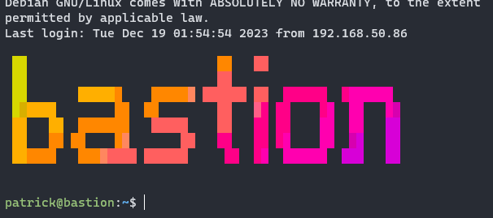

I saw a very interesting video by [Alex Kretzschmar](https://www.youtube.com/watch?v=GPQ6k2GR17I) about how to add a nice colorful login banner using Figurine that displays the hostname. I thought this would be helpful when working with several SSH sessions, so I added it to my hosts.

To do this quickly and use the hostname for the login message, you can use thise script, otherwise follow along below

> [!WARNING]
> Don't just take my word for it. Always inspect the code that will be running on your machines, especially from an untrusted and unsigned source.

```bash
curl https://gist.githubusercontent.com/binarypatrick/2e33d8d3c79210dc74077627cb0deb9c/raw/ | sudo bash
```



To start you need to download and install Figurine.

```bash
wget https://github.com/arsham/figurine/releases/download/v1.3.0/figurine_linux_amd64_v1.3.0.tar.gz -O deploy.tar.gz
tar -xvf deploy.tar.gz
sudo mv deploy/figurine /usr/local/bin
```

Once it's installed you can test it by running the following

```bash
figurine -f "3d.flf" `hostname`
```

Now you can create the profile script that will run on login.

```bash
sudo nano /etc/profile.d/figurine.sh
```

```text
echo ""
figurine -f "3d.flf" `hostname`
echo ""
```

You can test the file by running it manually.

```bash
sh /etc/profile.d/figurine.sh
```

Now that the file is created, exit and ssh back in to test it. Also don't forget to cleanup the download and unpacked files.

```bash
rm -rf deploy*
```
