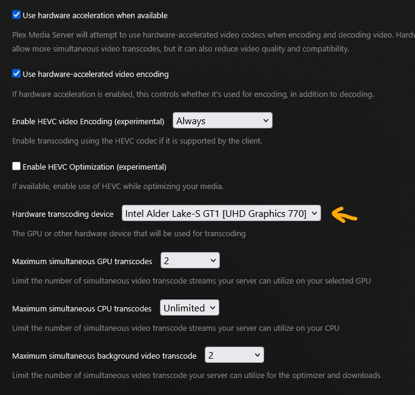
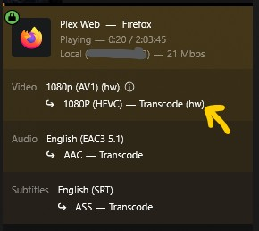

For a long time I've been trying to configure my Intel 12500 iGPU to transcode, and for a long time I've been failing. I literally mean years trying to get this to work. Taking stabs at it every so often, thinking I've gotten it, or gotten close only to fail. Now that I've actually got it working, I want to share, and hopefully help whoever else is struggling with this.

In my hunt, I've dug through proxmox guides in the forums, blog posts, youtube guides. I basically had given up, until I figured out the piece that was missing.

## Understand your Hardware

Every device is different, and the numbers matter. So I start by first enumerating my devices.

```bash
ls -la /dev/dri
```

The DRI in `/dev/dri` stands for Direct Rendering Infrastructure. It's a directory in Linux that contains device files used for direct GPU access.

Typically you'll find `/dev/dri/card0`, `card1`, etc. These respresent the GPU(s) installed in the machine.

Alongside them are the render nodes. `/dev/dri/renderD128`, `renderD129` These are also important for transcoding. They allow unprivileged GPU access for compute and rendering tasks (3D rendering, video encoding/decoding, GPU-accelerated computing) without requiring display out. Applications like Vulkan, OpenGL, VA-API, and CUDA can use these.

```bash
drwxr-xr-x  3 root root        100 Mar 16 15:04 .
drwxr-xr-x 21 root root       5260 Mar 18 20:12 ..
drwxr-xr-x  2 root root         80 Mar 16 15:05 by-path
crw-rw----  1 root video  226,   1 Mar 16 15:05 card1
crw-rw----  1 root render 226, 128 Mar 16 15:04 renderD128
```

You'll note on my machine, there is no `card0`, but there is a `card1` even though I only have 1 GPU. Also note the numbers following both the card and render node, `226:1` and `226:128`. These are the device driver major and minor numbers, identify what driver to use.

> [!NOTE]
> In proxmox, usually the user running PVE is root, so there shouldn't be a permissions issue.

## Granting access to the LXC

Stop your LXC in the GUI and then edit the configuration from the CLI. For this example I'm going to use LXC ID 100.

```bash
cd /etc/pve/lxc
nano 100.conf
```

In the configuration, you'll see all of the resources used by the LXC. At the bottom you can see the 4 lines I've added:

```diff
arch: amd64
cores: 6

features: nesting=1
hostname: plex
memory: 4096
net0: name=eth0,bridge=vmbr0,firewall=1,gw=10.8.8.1,hwaddr=0E:1B:49:3D:1B:34,ip=10.8.8.100/24,tag=8,type=veth
onboot: 1
ostype: debian
rootfs: pool:vm-100-disk-1,size=32G
startup: order=3
swap: 1024
tags: debian13

# kernel permissions
+lxc.cgroup2.devices.allow: c 226:1 rwm
+lxc.cgroup2.devices.allow: c 226:128 rwm

# device mapping
+dev0: /dev/dri/card1,gid=44
+dev1: /dev/dri/renderD128,gid=105
```

### cgroup v2

By default, LXC containers are denied access to all host devices. The cgroup device controller acts as a whitelist. Each `lxc.cgroup2.devices.allow` line punches a hole in that deny-all policy for a specific device.

Notice in the kernel permissions I've added the major and minor driver identifiers from before. `226:1` and `226:128` respectively.

Breaking it down by token:

- `c` - character device (as opposed to b for block device). DRI/GPU nodes are character devices.
- `226` - the major number, which identifies the device driver. 226 is the kernel's DRM (Direct Rendering Manager) driver.
- `128` - the minor number, which identifies the specific device instance under that driver. 128 for renderD128.
- rwm - the permissions
  - `r` - read
  - `w` - write
  - `m` - mknod (allows the container to create the device node if it doesn't exist)

So the full line is telling the cgroup to allow the LXC container to read, write, and create the character device with major:minor 226:128, which is my renderD128 render node.

### Device Permissions

Next, under cgroup, I've added the paths to the hardware on the host. You'll notice they match from before: `/dev/dri/card1` and `/dev/dri/renderD128`.

Breaking it down by token:

- `dev0` - the Proxmox config key, just an index for the device passthrough entry. dev0, dev1, dev2 etc. if you have multiple devices.
- `/dev/dri/card1` - the path on the host to the device being passed through. Proxmox will bind-mount this into the container.
- `gid=44` - the group ID that will own the device node inside the container. This is what makes it accessible to the video group (GID 44) inside the LXC, so the plex user can actually use it.

One important thing to understand is the GID here is applied to the device node as seen from **_inside_** the container. That's why it needs to match the GID of the video/render group inside the LXC specifically, not necessarily the host's GID. Often they are the same, though sometimes they are not, _which was my problem_.

Once all that is configured and saved. I can start the LXC and run the following command inside the container to find the correct GID.

```bash
getent group video render
```

For my container, I got back the following.

```bash
video:x:44:plex
render:x:105:plex
```

This is where the GIDs in my configuration are derived, `44` and `105` respectively. If they don't match, shut down the container and go back to the host lxc configuration and update them.

> [!IMPORTANT]
> the device GID refers to the device node as seen from **_inside_** the container.

## Restart or Reinstall Plex

Sometimes restarting Plex is all you need to get it to see the new device. In my case I actually had to reinstall it.

```bash
sudo systemctl restart plexmediaserver
```

or

```bash
sudo apt reinstall plexmediaserver
sudo systemctl enable --now plexmediaserver
```

On a reinstall, you should see your hardware device in the CLI output.

```bash
PlexMediaServer install: PlexMediaServer-1.43.0.10492-121068a07 - Installation starting.
PlexMediaServer install:
PlexMediaServer install: Now installing based on:
PlexMediaServer install:   Installation Type:   Update
PlexMediaServer install:   Process Control:     systemd
PlexMediaServer install:   Plex User:           plex
PlexMediaServer install:   Plex Group:          plex
PlexMediaServer install:   Video Group:         render
PlexMediaServer install:   Metadata Dir:        /var/lib/plexmediaserver/Library/Application Support
PlexMediaServer install:   Temp Directory:      /mnt/transcode  (set in Preferences.xml)
PlexMediaServer install:   Lang Encoding:       en_US.UTF-8
PlexMediaServer install:   Processor:           12th Gen Intel(R) Core(TM) i5-12500T
PlexMediaServer install:   Intel i915 Hardware: Found
PlexMediaServer install:   Nvidia GPU card:     Not Found
PlexMediaServer install:
PlexMediaServer install: Completing final configuration.
PlexMediaServer install: Starting Plex Media Server.
PlexMediaServer install: PlexMediaServer-1.43.0.10492-121068a07 - Installation successful.  Errors: 0, Warnings: 0
```

Then check to make sure the service is running.

```bash
sudo systemctl status plexmediaserver
```

```bash
* plexmediaserver.service - Plex Media Server
     Loaded: loaded (/lib/systemd/system/plexmediaserver.service; enabled; preset: enabled)
     Active: active (running) since Thu 2026-03-19 02:03:02 UTC; 2min 22s ago
   Main PID: 3412 (Plex Media Serv)
      Tasks: 71 (limit: 18742)
     Memory: 96.7M
        CPU: 2.984s
```

## Configuring Transcoding

In Plex, go to settings and then on the sidebar Settings > Transcoder. Make sure to check `Use hardware-accelerated video encoding`, and the device should now appear in the `Hardware transcoding device` dropdown. For me it's an Intel Alder Lake-S GT1 [UHD Graphics 770], and most importantly supports Intel QuickSync.



Now when I play a video, I see the venerated (hw) tag



Just to be sure, you can also run intels GPU `top` which shows the render and video usage.

```bash
sudo intel-gpu-top
```

---

🎉🎉🎉 Happy Transcoding 🎉🎉🎉

---

## Additional Reading

Here are some blog posts and resources that I found helpful too

- <https://stanislas.blog/2025/01/plex-transcode-intel-n100-gpu-proxmox/>
- <https://laury.dev/snippets/enable-intel-integrated-gpu-on-linux/>
- <https://www.derekseaman.com/2023/04/proxmox-plex-lxc-with-alder-lake-transcoding.html>
- <https://forum.proxmox.com/threads/plex-in-lxc-cannot-perform-hw-transcoding.168904/>
